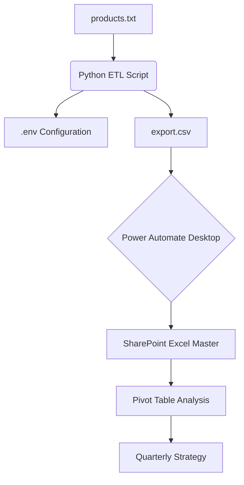

# Supply Chain & Procurement Automation

**A professional automation solution built to modernize vendor data retrieval and drive business intelligence.**

---

## The Problem & The Solution

In my current role, maintaining accurate pricing and inventory data for hundreds of SKUs was a manual, time-consuming process. Checking vendor portals individually was slow and prone to human error.

I developed this **Asynchronous Python ETL Suite** to automate this workflow. It transforms a labor-intensive administrative task into a streamlined data pipeline, allowing our procurement team to focus on strategic analysis rather than data entry.

## Business Impact & Value

*   **Efficiency:** Reduced data collection time from hours of manual work to less than 60 seconds of automated processing.
*   **Cost Avoidance:** Enabled real-time tracking of price fluctuations, preventing overpayment on volatile SKUs.
*   **Business Intelligence:** Feeds a master analysis suite where **Pivot Tables** track month-over-month trends, helping the business make data-driven procurement decisions.

## The Workflow

1.  **Extract:** Python script uses `asyncio` to pull live data from vendor APIs.
2.  **Automate:** Power Automate Desktop triggers on script completion to import the new data.
3.  **Analyze:** The data is appended to a master Excel dataset where I use Pivot Tables to compare historical pricing and inventory levels.

## Technical Skills Demonstrated

*   **Asynchronous API Integration:** Used `httpx` and `asyncio` to handle concurrent requests, maximizing throughput while respecting API limits with semi-phores.
*   **Production-Ready Security:** Implemented `python-dotenv` for credential management. The script is fully anonymized—all proprietary endpoints and brand mentions are managed via local environment variables.
*   **Cross-Platform Portability:** Engineered robust path handling (using `sys.executable` checks) to ensure the script runs reliably as a standalone binary on Windows, macOS, and Linux.
*   **Data Integrity:** Utilized `pandas` for deduplication and transformation, ensuring clean data for downstream BI tools.

## ⚙️ How to Use (Generic Setup)

1.  **Install:** `pip install pandas httpx python-dotenv`
2.  **Configure:** Setup a `.env` file with your `REMOTE_BASE_URL` and API credentials (see `.env.example`).
3.  **Run:** Execute `python v2csv.py` to generate the `export.csv` report.

---
> **Note:** To protect company privacy and comply with data security standards, all proprietary vendor branding and endpoints have been moved to environment variables. 
